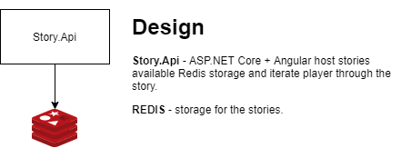

# Lobster Inc Assessment
Lobster Assessment is an implementation of .NET Software Engineer Technical Assignment task. [pdf](docs/assessment.pdf)

## High level design 

## Prerequisites
* docker 
* docker-compose
* .NET Core SDK 3.1
* PowerShell

## How to run application without Visual Studio
 * Just run **_start.bat** script
 * Grab url for **storyhost** container and open in the browser
 * Enjoy!

## Releases
 
## Tech Stack
 * [ASP.NET Core](https://docs.microsoft.com/en-us/aspnet/core/?view=aspnetcore-3.1)
 * [Angular](https://angular.io/)
 * [Docker](https://www.docker.com/)
 * [Cake Build](https://cakebuild.net/)
 * [NUnit](https://nunit.org/)
 * [MediatR](https://github.com/jbogard/MediatR)
 * [AutoMapper](https://automapper.org/)
 * [Redis](https://redis.io/)
 * [StackExchange Redis](https://github.com/StackExchange/StackExchange.Redis)
 * [Newtonsoft Json](https://www.newtonsoft.com/json)

## Principles:
 * SOLID
 * Clean Arhitecture
 * CQRS
 * Feature Folders
 * TDD

## Ideas
 * js unit tests
 * Back-office to create stories/questinaries
 * Separate Angular and Api apps and docker files

# License

Lobster Assessment is open source software, licensed under the terms of MIT license. 
See [LICENSE](LICENSE) for details.

